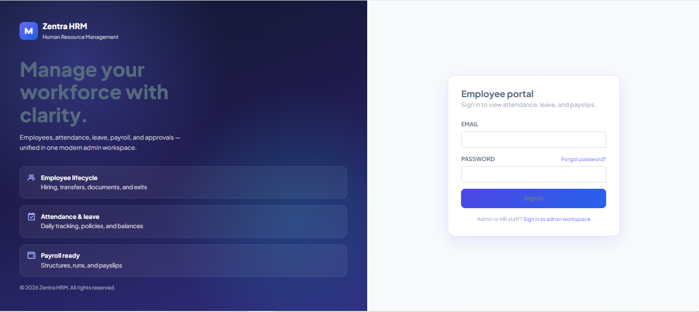
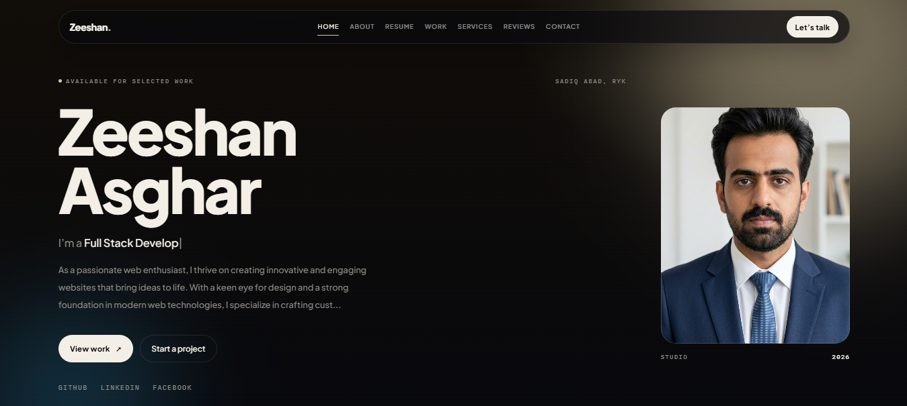

  

 

## About

I'm **Zeeshan Asghar**, Founder & CEO of **[Ledrix](https://ledrix.co)** — a multi-tenant CRM that keeps agency client brands, leads, and payments from mixing. Senior Web Enthusiast, full-stack builder of CRMs, dashboards, POS systems, and e-commerce platforms. Below are the products I'm actively shipping.

 

## Tech Stack

 

## Featured Projects

<table width="100%">
<tr>
<td width="50%" valign="top">

**Ledrix** — Core SaaS product
Multi-tenant CRM that isolates each client brand's leads, seller access, and Stripe/PayPal merchant — one agency workspace, zero mixing.

`CRM` `SaaS` `Multi-Tenant`

 

</td>
<td width="50%" valign="top">

**Ledrix-Enterprise** — Enterprise build
Scaled version of Ledrix CRM for larger agencies running many brands, closers, and merchant accounts at once.

`Enterprise` `CRM` `Scalable`

</td>
</tr>

<tr>
<td width="50%" valign="top">

**LeadHub** — Lead management
Track, organize, and convert sales leads with a focused pipeline built for closers.

`CRM` `Sales` `Pipeline`

</td>
<td width="50%" valign="top">

**pos-software** — Point of Sale
Shoe Store POS — a shop-counter register for scanning, collecting payment, and tracking till/stock per shop location.

`POS` `Retail` `Inventory`

</td>
</tr>

<tr>
<td width="50%" valign="top">

**NoveStore** — E-commerce platform
DHANG shop front — browse custom repatched tees and drops, filter collections, and checkout with COD.

`E-commerce` `Storefront` `Web App`

</td>
<td width="50%" valign="top">

**real-estate** — Property platform
Zed Properties — an independent property dealer site for browsing listings and talking directly to the dealer.

`Real Estate` `Listings` `Full-Stack`

</td>
</tr>

<tr>
<td width="50%" valign="top">

**hrm** — HR management
Zentra HRM — employee lifecycle, attendance & leave, and payroll-ready structures in one admin workspace.

`HR` `Management` `Enterprise`

</td>
<td width="50%" valign="top">

**portfolio** — Personal site
My developer portfolio — work, resume, services, and reviews for freelance and studio projects.

`Portfolio` `Frontend` `Personal`

</td>
</tr>
</table>

 

## Contribution Matrix

 

## GitHub Stats

 

## Connect

